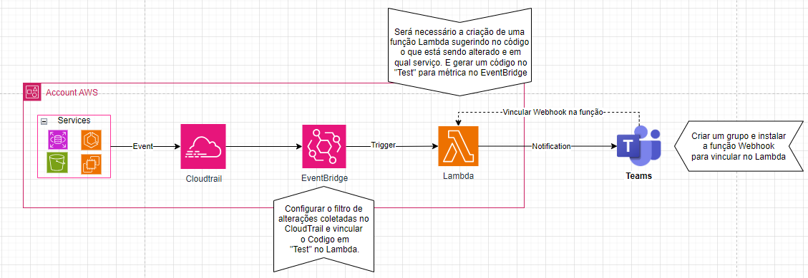

# Notificação de eventos no Cloudtrail

## Objetivo
Essa solução tem como objetivo facilitar uma auditoria em cima dos serviços AWS desejados, com ela você recebe notificações de eventos gerados no Cloudtrail de serviços que possam ser de interesse de liderança ou organização, por exemplo, saber o usuário que alterou ou criou um novo banco de dados ou instancia há muito tempo. Com isso o time terá muito mais agilidade e acertividade na consulta de eventos criticos mapeados.

_**Baixe o diagrama .drawio para ter uma visão detalhada da arquitetura**_