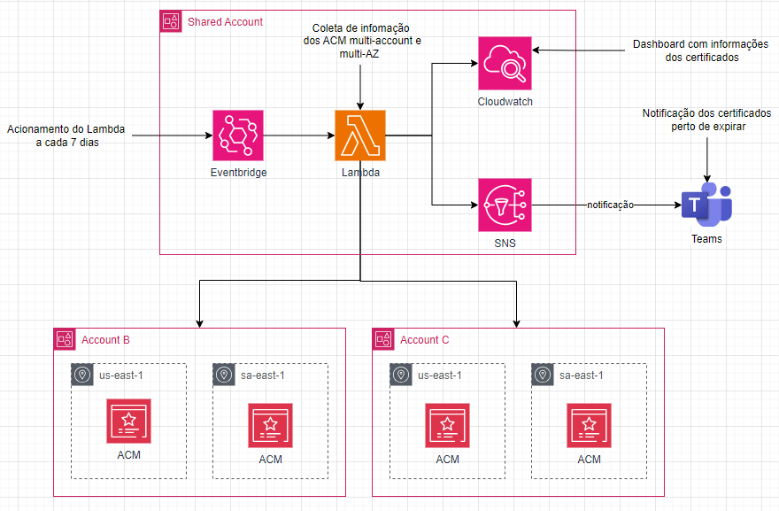

# Listagem de Certificados ACM.

## Objetivo:
Esse projeto tem como intuito fazer auditoria de certificados do ACM de todas as contas de uma organização na AWS em um único board do Cloudwatch.

## Recursos utilizados:
* Lambda;
* SNS;
* CloudWatch;
* EventBridge;
* ACM Certificate;
* IAM Roles.

## Metodo de funcionamento:
Criar um lambda com Python utilizando as bibliotecas do boto3, onde o mesmo faz a listagem de certificados ao ser ativado. O código também tem como função fazer controle de certificados que estão próximos de seu vencimento, para que seja tomado alguma providencia, para isso quando trigado o lambda dispara um evento para o MicrosoftTeams(ou outra ferramenta de comunicação) avisando que os certificados com vigência menor que 60 dias estão vencendo. Há um EventBrigde que irá ativar esse lambda de 7 em 7 dias.
Ao ativar o lambda será exibido em seus logs em formato de tabela, todos os certificados, contendo o numero da conta, a região, domínio, data de expiração e os recursos atrelados a ele. Com isso, um board do Cloudwatch irá consumir esses dados e listá-los, dando visibilidade dos certificados e suas respectivas informações.

_**Baixe o diagrama .drawio para ter uma visão detalhada da arquitetura**_